# Phase 6 Evaluation Report: Scam Tactic Detection & Evidence Engine

## 1. Executive Summary

Phase 6 introduces a deterministic, offline, and explainable **Scam Tactic Detection and Evidence Engine** for ScamShield AI. The system identifies behavioral manipulation techniques and anchors every detected tactic to character-exact textual spans (`text[start:end] == matched_text`).

### Key Evaluation Highlights
* **Human-Annotated Pilot Benchmark (60 samples)**:
  * **Exact Set Match Rate**: **71.7%** (43 / 60 messages matched human ground truth across all tactic labels simultaneously).
  * **Micro Precision**: **95.7%** (45 / 47 predicted tactics were true positives).
  * **Micro Recall**: **69.2%** (45 / 65 ground-truth tactics recovered).
  * **Micro F1-Score**: **0.804**.
  * **Verbatim Evidence Offset Integrity**: **100.0%** (zero span mismatches or index drift).
* **Exploratory Distribution on UCI SMS Corpus (5,574 samples, `rule_generated`)**:
  * **Spam tactic prevalence**: **47.4%** (354 / 747 spam messages exhibit $\ge 1$ tactic).
  * **Ham tactic prevalence**: **2.6%** (125 / 4,827 non-scam messages exhibit $\ge 1$ tactic).
  * **Signal discrimination ratio**: **18.2x** higher tactic density in scam messages versus legitimate communications.

---

## 2. Evaluation Methodology

### 2.1 Ground Truth Benchmark
The primary benchmark is the **60-sample Human Annotation Pilot Dataset** (`data/evaluation/annotation_pilot/pilot_dataset.jsonl`), curated during Phase 1D according to the ScamShield AI Annotation Guidelines (`data/metadata/annotation_guidelines.md`).
* 30 scam samples
* 30 non-scam samples
* High label confidence across all samples
* Multi-label tactic annotations spanning the 23-tactic taxonomy

### 2.2 Metrics Defined
* **Exact Set Match**: Predicted tactic set $\mathcal{T}_{\text{pred}}$ equals ground truth set $\mathcal{T}_{\text{gt}}$ exactly ($\mathcal{T}_{\text{pred}} = \mathcal{T}_{\text{gt}}$).
* **Precision**: $\frac{\text{TP}}{\text{TP} + \text{FP}}$ per tactic and micro-averaged.
* **Recall**: $\frac{\text{TP}}{\text{TP} + \text{FN}}$ per tactic and micro-averaged.
* **F1-Score**: $\frac{2 \cdot \text{Precision} \cdot \text{Recall}}{\text{Precision} + \text{Recall}}$.
* **Evidence Offset Verification**: For every span $s$, verify that $0 \le s.\text{start} < s.\text{end} \le \text{len}(\text{text})$ and $\text{text}[s.\text{start}:s.\text{end}] == s.\text{matched\_text}$.

---

## 3. Human Pilot Dataset Evaluation Results

### 3.1 Overall Aggregate Metrics

| Metric | Pilot Dataset Value | Status / Assessment |
| :--- | :--- | :--- |
| **Total Evaluation Samples** | 60 | 30 scam, 30 non-scam |
| **Exact Set Matches** | **43 / 60 (71.7%)** | Strong generalization without over-fitting |
| **Total Ground Truth Tactics** | 65 | Human-annotated labels |
| **Total Predicted Tactics** | 47 | Rule-extracted labels |
| **True Positives (TP)** | 45 | Verified matches |
| **False Positives (FP)** | 2 | Minimal false alarms |
| **False Negatives (FN)** | 20 | Conservative rule coverage |
| **Micro Precision** | **95.7% (0.957)** | Highly reliable when triggered |
| **Micro Recall** | **69.2% (0.692)** | Prudent recall prioritizing precision |
| **Micro F1-Score** | **80.4% (0.804)** | Robust baseline for deterministic rules |
| **Verbatim Span Accuracy** | **100.0%** | Zero indexing errors across all 60 samples |

### 3.2 Per-Tactic Performance Breakdown

The table below reports per-tactic evaluation across all tactics occurring in the human-annotated pilot dataset:

| Tactic | Severity | TP | FP | FN | Precision | Recall | F1-Score |
| :--- | :---: | :---: | :---: | :---: | :---: | :---: | :---: |
| **link_redirection** | Medium | 12 | 0 | 2 | **1.00** | **0.86** | **0.92** |
| **verification_request** | Medium | 4 | 0 | 0 | **1.00** | **1.00** | **1.00** |
| **reward_claim** | Low | 12 | 0 | 5 | **1.00** | **0.71** | **0.83** |
| **payment_request** | High | 6 | 0 | 4 | **1.00** | **0.60** | **0.75** |
| **urgency** | Medium | 5 | 0 | 4 | **1.00** | **0.56** | **0.71** |
| **impersonation** | Medium | 4 | 1 | 2 | **0.80** | **0.67** | **0.73** |
| **romance_manipulation** | Medium | 2 | 1 | 1 | **0.67** | **0.67** | **0.67** |
| **refund_claim** | Low | 0 | 0 | 1 | 0.00 | 0.00 | 0.00 |
| **personal_information_request** | Medium | 0 | 0 | 1 | 0.00 | 0.00 | 0.00 |
| *14 other tactics* | *Various* | 0 | 0 | 0 | N/A | N/A | N/A |

> **Key Observation**: For `link_redirection`, `verification_request`, `reward_claim`, `payment_request`, and `urgency`, the engine achieved **100% Precision**. When the engine claims a manipulation tactic is present, it is virtually always correct.

---

## 4. Error Analysis & Disagreements

A granular review of all 17 sample disagreements reveals specific patterns:

### 4.1 False Positive Analysis (2 samples)
1. **`uci_sms_0172` (Non-scam)**:
   * *Text*: `"Sir, I need AXIS BANK account no and bank address."`
   * *Ground Truth*: `['personal_information_request']`
   * *Engine Prediction*: `['impersonation']`
   * *Root Cause*: The incoming text mentions `"AXIS BANK"`. The brand matching rule triggered because the customer referenced a real bank in an inquiry. The human annotator interpreted the customer asking for account details as personal info request rather than impersonation.
   * *Remedy for Phase 7/8*: Require directional grammatical cues (e.g., "from Axis Bank" or "this is Axis Bank") to differentiate customer inquiries from sender impersonation.
2. **`uci_sms_0140` (Non-scam)**:
   * *Text*: `"You'll not rcv any more msgs from the chat svc. For FREE Hardcore services text GO to: 69988 If u get nothing u must Age Verify with yr network & try again"`
   * *Ground Truth*: `['verification_request']`
   * *Engine Prediction*: `['romance_manipulation', 'verification_request']`
   * *Root Cause*: The phrase `"chat svc"` triggered the adult/dating service rule (`rom_chat_002`). The annotator did not annotate romance manipulation, viewing it purely as a network service alert. This is arguably an under-annotation in the pilot benchmark.

### 4.2 False Negative Analysis (Primary Themes)
1. **Obscure 2004 UK Mobile Billing Jargon (Payment Request Misses)**:
   * Samples `uci_sms_0226`, `uci_sms_0251`, `uci_sms_0358`, `uci_sms_0068`, `uci_sms_0148`.
   * *Phrasings*: `"150ppmx3age16"`, `"1.50gbp/mtmsg18"`, `"150p per msg reply"`, `"18+6*£1.50(moreFrmMob. ShrAcomOrSglSuplt)10"`.
   * *Explanation*: The rules target standard currency and billing expressions. Extremely concatenated UK operator tariff abbreviations were not completely matched.
2. **Corrupted Characters & Encoding Glitches (Reward Claim Misses)**:
   * Samples `uci_sms_0013`, `uci_sms_0115`:
   * *Phrasing*: `"our 100,000 Prize Jackpot"`, `"won a 1000 prize GUARANTEED"`.
   * *Explanation*: Character encoding replacements (``) disrupted exact word boundary patterns in legacy UCI text.
3. **Conversational Urgency Phrasings**:
   * Sample `uci_sms_0210`: `"You please give us connection today itself before <DECIMAL> or refund the bill"`.
   * *Explanation*: Phrasing `"today itself"` was conversational Indian English not captured by the initial formal deadline rule.

---

## 5. Grounded Verbatim Evidence Examples

Every detected tactic produces an `EvidenceSpan` validated against the original text. The table below presents representative examples from the evaluation run:

| Sample ID | Tactic | Matched Text | Offsets `[start:end]` | Verbatim Verification | Reason / Rule ID |
| :--- | :--- | :--- | :---: | :---: | :--- |
| `uci_sms_0013` | `urgency` | `"URGENT"` | `[0:6]` | `text[0:6] == "URGENT"` | Pressures recipient to act immediately (`urg_action_001`) |
| `uci_sms_0013` | `link_redirection` | `"www.dbuk.net"` | `[90:101]` | `text[90:101] == "www.dbuk.net"` | Embedded external URL (`lnk_url_002`) |
| `uci_sms_0121` | `impersonation` | `"Your 2004 Account Statement"` | `[9:36]` | `text[9:36] == "Your 2004 Account Statement"` | Claims customer service/statement desk (`imp_customer_008`) |
| `uci_sms_0121` | `reward_claim` | `"Bonus Points"` | `[75:87]` | `text[75:87] == "Bonus Points"` | Promises unearned bonus points (`rew_bonus_002`) |
| `uci_sms_0121` | `verification_request` | `"Identifier Code: 45239"` | `[112:134]` | `text[112:134] == "Identifier Code: 45239"` | Prompts verification identifier (`ver_action_002`) |
| `uci_sms_0140` | `verification_request` | `"Age Verify with yr network"` | `[112:138]` | `text[112:138] == "Age Verify with yr network"` | Demands age verification (`ver_action_002`) |
| `uci_sms_0226` | `urgency` | `"MUST GO"` | `[29:36]` | `text[29:36] == "MUST GO"` | Urgent clearance deadline (`urg_sms_004`) |
| `uci_sms_0226` | `payment_request` | `"From ONLY 1"` | `[65:77]` | `text[65:77] == "From ONLY 1"` | Carrier price solicitation (`pay_carrier_004`) |

---

## 6. Exploratory Evaluation on UCI SMS Corpus

> [!NOTE]
> The UCI SMS Spam Collection contains binary labels (`scam` vs `non_scam`), but does **not** contain human ground-truth tactic annotations. Therefore, this evaluation is an **exploratory study labeled strictly as `rule_generated`**.

### 6.1 Dataset Coverage
* **Total Messages Analyzed**: 5,574
* **Spam Messages**: 747
* **Non-Scam (Ham) Messages**: 4,827

### 6.2 Tactic Prevalence Comparison

```mermaid
xychart-beta
    title "Tactic Prevalence: Spam vs Non-Scam (UCI Corpus)"
    x-axis ["Payment", "Link Redirection", "Reward", "Urgency", "Impersonation", "Verification"]
    y-axis "Percentage of Messages (%)" 0 --> 20
    bar [14.3, 14.2, 12.2, 10.4, 9.9, 2.4]
    bar [0.0, 0.04, 0.0, 1.2, 0.5, 0.0]
```

### 6.3 Detailed Tactic Frequency Table (`rule_generated`)

| Tactic | Spam Count (out of 747) | Spam % | Ham Count (out of 4,827) | Ham % | False Positive Risk |
| :--- | :---: | :---: | :---: | :---: | :---: |
| **payment_request** | 107 | 14.3% | 0 | 0.0% | Extremely Low |
| **link_redirection** | 106 | 14.2% | 2 | 0.04% | Extremely Low |
| **reward_claim** | 91 | 12.2% | 0 | 0.0% | Extremely Low |
| **urgency** | 78 | 10.4% | 57 | 1.2% | Low (conversational words) |
| **impersonation** | 74 | 9.9% | 24 | 0.5% | Very Low (brand mentions) |
| **verification_request** | 18 | 2.4% | 0 | 0.0% | Extremely Low |
| **romance_manipulation**| 4 | 0.5% | 42 | 0.9% | Moderate (terms of affection) |
| **Any Tactic ($\ge 1$)** | **354** | **47.4%** | **125** | **2.6%** | **Strong Discriminator** |

### 6.4 Key Insights from Exploratory Run
1. **High Selectivity**: 97.4% of legitimate conversational messages trigger **zero** tactics. The negative contextual guards and specific patterns prevent false alarms on day-to-day messaging.
2. **Spam Characteristics**: Nearly half (47.4%) of all spam messages in the UCI dataset exhibit explicit manipulation tactics detectable by this offline rule engine alone.
3. **Primary Ham Noise**:
   * Conversational urgency ("come right now", "call me urgently") accounted for 57 ham triggers.
   * Affectionate phrasing ("my love", "darling") between family/partners accounted for 42 ham triggers.

---

## 7. Conclusions and Next Phase Recommendations

1. **Phase 6 Success**: The tactic detection and evidence engine successfully provides deterministic, 100% offset-anchored explanations without requiring ML retraining or external dependencies.
2. **Safe Integration**: Tactic detection does not emit a final classification score or binary verdict, preserving clear architectural separation from Phase 3 and Phase 5 models.
3. **Foundation for Downstream Explanation**: The extracted `EvidenceSpan`s provide high-precision rationales ready to be consumed by explanation generators, risk synthesizers, and forensic auditing interfaces in future phases.
