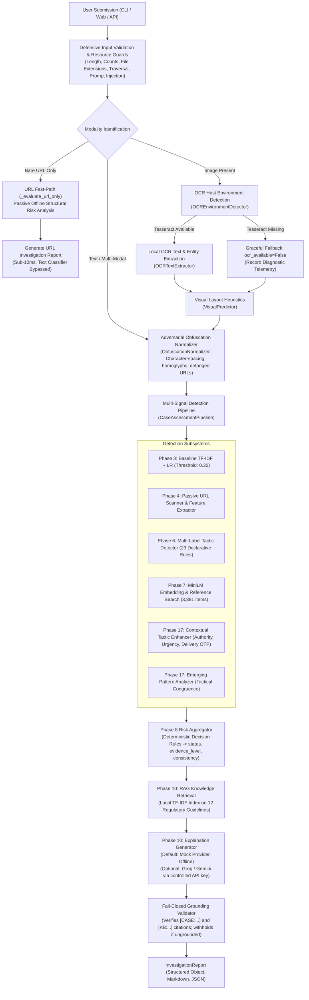

# ScamShield AI — Phase 18A Runtime Architecture Audit

## 1. Actual Production Execution Flow

The production execution path maps user input through sequential defensive guards, modality-specific routing, multi-signal detection, evidence aggregation, and grounded explanation.

---

## 2. Component Responsibilities & Dependencies

| Pipeline Stage | Module / Component | Responsibilities & Invariants | Downstream Consumers |
|---|---|---|---|
| **Input Guards** | `src/security/guards.py`, `src/security/prompt_defense.py` | Enforces 50K text bound, 2K URL bound, 10MB image bound, 4096px dimension bound; blocks directory traversal and UNC paths; detects prompt injection patterns. | All downstream stages |
| **Normalizer** | `src/phase17/text_normalizer.py` | Deterministically collapses intra-word character spacing (`U R G E N T`), converts Cyrillic homoglyphs, restores defanged URLs. | Text classifier, tactic detector, semantic embedder |
| **OCR Adapter** | `src/ocr/environment.py`, `src/ocr/extractor.py` | Probes host Tesseract availability safely; performs local OCR text extraction if present; falls back gracefully without unhandled exceptions. | Preprocessor, entity extractor |
| **URL Analysis** | `src/url_analysis/url_scanner.py` | Offline parsing of domain, TLD, IP structure, entropy, and subdomain depth. 100% passive, 0 DNS/HTTP calls. | Risk aggregator, URL evidence panel |
| **Text Classifier** | `src/models/baseline_classifier.py` | Evaluates Phase 3 Word TF-IDF + Logistic Regression against frozen threshold `0.30`. | Risk aggregator |
| **Tactic Detection** | `src/tactics/tactic_detector.py`, `src/tactics/phase17_contextual_tactics.py` | Extracts 23 declarative tactics + multi-token contextual authority coercion; disambiguates delivery brand mentions. | Risk aggregator, evidence spans |
| **Semantic Analysis** | `src/semantic/analyzer.py`, `src/semantic/reference_index.py` | MiniLM 384-d dense embedding search over 3,881 reference cases; computes top-1 cosine similarity and semantic novelty score. | Risk aggregator, novelty warnings |
| **Emerging Patterns** | `src/phase17/emerging_pattern_analyzer.py` | Detects tactical congruence on novel semantic themes without keyword memorization. | Risk aggregator |
| **Risk Aggregation** | `src/aggregation/aggregator.py` | Deterministic priority rules mapping multi-signal inputs to `likely_scam`, `likely_non_scam`, `mixed_signals`, or `insufficient_evidence`. | Final report, UI, CLI |
| **RAG Retrieval** | `src/rag/retriever.py` | Retrieves top-k relevant regulatory advice chunks from local 12-chunk corpus. | Explanation generator |
| **Explanation & Gatekeeper** | `src/explanation/generator.py`, `src/explanation/validator.py` | Synthesizes grounded explanation; fail-closed gatekeeper suppresses text if citations fail grounding verification. | Final report |

---

## 3. Security, Network, and Isolation Boundaries

1. **Zero-Network Invariant**:
   - The default operational mode (`OFFLINE_MODE=True`) guarantees zero outbound socket connections, zero HTTP/HTTPS requests, and zero DNS lookups.
   - External LLM providers (Groq, Gemini) are strictly opt-in, disabled by default, and isolated to the explanation synthesis layer; they cannot influence upstream detection verdicts.
2. **Deterministic Isolation**:
   - Upstream detection verdicts (`assessment.status`) are strictly determined by deterministic ML models and Phase 8 aggregation rules. GenAI components cannot alter, override, or weaken risk assessments.
3. **Fail-Closed Grounding**:
   - If an LLM explanation fails citation validation or generates contradictory claims, the explanation is suppressed, and a safe deterministic summary is presented.
4. **Process Caching Boundaries**:
   - Heavy models (`TextEmbedder`, `BaselineTextClassifier`, `SemanticReferenceIndex`, `KnowledgeRetriever`) are cached as thread-safe process singletons via `ModelArtifactCache`.
   - Caching is strictly isolated to model parameters and indices; user submissions, case texts, and investigation results are never cached.
