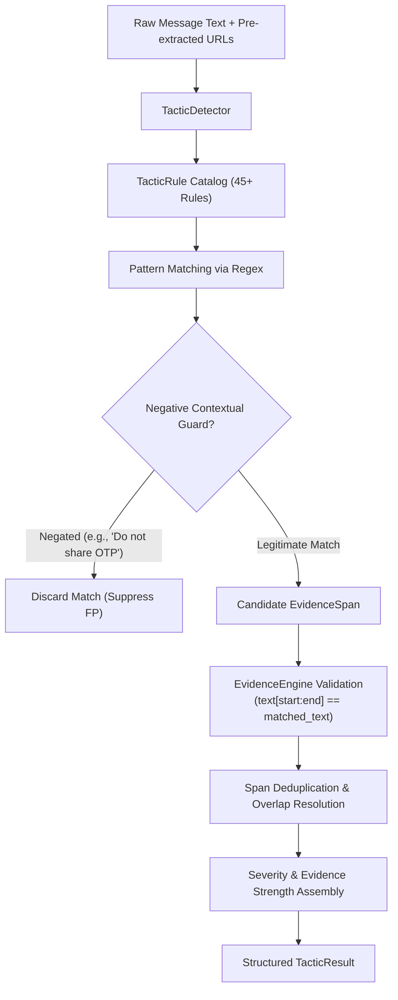

# Phase 6 Specification: Scam Tactic Detection & Evidence Engine

## 1. Executive Summary & Purpose

In **ScamShield AI**, fraud detection must not only produce a risk assessment but must provide **explainable, verifiable evidence** of how manipulation occurs. 

A central design principle of ScamShield AI is the strict separation of concepts:
$$\text{SCAM CATEGORY} \ne \text{SCAM TACTIC} \ne \text{SCAM CLASSIFICATION}$$

* **Scam Category**: The overarching fraudulent scenario or narrative (e.g., *Digital Arrest*, *Electricity Disconnection*, *KYC Fraud*, *Part-time Job Scam*).
* **Scam Tactic**: The atomic behavioral, psychological, or operational manipulation techniques employed within the message (e.g., *urgency*, *threat*, *impersonation*, *otp_request*, *link_redirection*). A single message typically combines multiple tactics.
* **Scam Classification**: The global statistical determination of whether a communication is deceptive (produced by Phase 3 text model or Phase 5 hybrid model).

**Phase 6 implements the Scam Tactic Detection and Evidence Engine**. It identifies these atomic tactics and grounds every finding in exact, character-level text spans (`text[start:end] == matched_text`). Crucially, Phase 6 **does not output an overall scam risk score or binary classification verdict**; it functions as a modular evidentiary layer.

---

## 2. Architecture & Pipeline



### Component Structure
* [`src/tactics/schemas.py`](file:///c:/Users/radika/OneDrive/Desktop/ScamShieldAI/src/tactics/schemas.py): Strongly-typed dataclasses for `EvidenceSpan`, `DetectedTactic`, and `TacticResult`.
* [`src/tactics/normalization.py`](file:///c:/Users/radika/OneDrive/Desktop/ScamShieldAI/src/tactics/normalization.py): Exact substring matcher `find_pattern_spans` operating on the original text, and `is_contextually_negated` window inspection.
* [`src/tactics/evidence.py`](file:///c:/Users/radika/OneDrive/Desktop/ScamShieldAI/src/tactics/evidence.py): `EvidenceEngine` responsible for bounding verification, overlap resolution (retaining longest/most specific span), and tactic assembly.
* [`src/tactics/tactic_rules.py`](file:///c:/Users/radika/OneDrive/Desktop/ScamShieldAI/src/tactics/tactic_rules.py): The declarative repository of 45+ context-aware rules covering all 23 canonical tactics with negative guards.
* [`src/tactics/tactic_detector.py`](file:///c:/Users/radika/OneDrive/Desktop/ScamShieldAI/src/tactics/tactic_detector.py): Top-level orchestrator supporting single-message and batch detection.

---

## 3. Canonical 23-Tactic Taxonomy

The 23 tactics are defined consistently with `data/metadata/annotation_guidelines.md` and `data/metadata/indian_scam_taxonomy.md`:

| # | Tactic Identifier | Canonical Severity | Core Definition | Example Triggers |
| :- | :--- | :---: | :--- | :--- |
| 1 | `impersonation` | Medium | Misrepresents sender as a bank, telecom, government agency, utility, tech firm, courier, or executive. | `"SBI"`, `"HDFC Bank"`, `"Income Tax Dept"`, `"Electricity Board"`, `"Microsoft Support"` |
| 2 | `urgency` | Medium | Pressures the recipient to act promptly with artificial countdowns, immediate action demands, or short deadlines. | `"immediately"`, `"within 24 hours"`, `"expires today"`, `"must go"`, `"act now"` |
| 3 | `threat` | Medium | Threatens adverse legal actions, arrest warrants, police complaints, penalties, or service disconnection. | `"arrest warrant"`, `"legal action will be taken"`, `"penalty of Rs 5000"`, `"permanently terminated"` |
| 4 | `fear_creation` | Medium | Fabricates distressing or criminal situations (e.g., narcotics in parcel, digital arrest, intimate video extortion, hospital emergency). | `"under digital arrest"`, `"narcotics found in parcel"`, `"recorded webcam video"`, `"son in ICU"` |
| 5 | `authority_claim` | Medium | Claims statutory weight or compliance directives from regulatory, judicial, or government entities. | `"under section 144"`, `"as per RBI mandate"`, `"statutory directive"`, `"by order of court"` |
| 6 | `payment_request` | High | Directly instructs financial remittance, advance processing fees, UPI transfers, crypto wallet deposits, or gift cards. | `"pay Rs 1500 immediately"`, `"processing fee"`, `"send bitcoin"`, `"pay via UPI"`, `"charged 150p/msg"` |
| 7 | `credential_request` | High | Solicits private authentication credentials, netbanking passwords, ATM PINs, CVVs, or seed phrases. | `"enter password"`, `"share ATM PIN"`, `"CVV number"`, `"crypto seed phrase"` |
| 8 | `otp_request` | High | Directly instructs the recipient to disclose, forward, or speak a One-Time Password. | `"share your OTP"`, `"send the OTP"`, `"forward the 6-digit code"` |
| 9 | `personal_information_request` | Medium | Requests government-issued IDs, Aadhaar numbers, PAN cards, passport details, or date of birth. | `"send Aadhaar card"`, `"provide PAN number"`, `"passport copy"` |
| 10 | `account_suspension` | High | Alerts recipient that an account, bank card, SIM card, or utility service is blocked or facing termination. | `"account will be blocked"`, `"sim card deactivated"`, `"power connection will be cut off"` |
| 11 | `verification_request` | Medium | Solicits mandatory identity verification, KYC update, PAN-bank linking, or account validation. | `"verify your account"`, `"update your KYC"`, `"link PAN to account"`, `"re-verify SIM"` |
| 12 | `reward_claim` | Low | Lures recipient with unearned lottery wins, gift cards, bonus points, lucky draws, or cashback. | `"you have won Rs 50000"`, `"KBC lucky draw"`, `"unredeemed bonus points"`, `"guaranteed prize"` |
| 13 | `investment_pressure` | Medium | Promotes unrealistic, guaranteed, or rapid investment returns, VIP trading groups, or crypto schemes. | `"guaranteed daily return"`, `"double your money"`, `"VIP trading group"`, `"risk-free profit"` |
| 14 | `job_offer` | Low | Advertises high-paying, minimal-effort remote tasks, like-and-subscribe schemes, or hotel review jobs. | `"part-time job available"`, `"earn Rs 3000 daily from home"`, `"like youtube videos and earn"` |
| 15 | `emotional_manipulation` | Medium | Exploits compassion, moral obligation, or desperation to solicit funds. | `"stranded without money"`, `"matter of life and death"`, `"begging you to help"`, `"have mercy"` |
| 16 | `secrecy_request` | High | Demands recipient keep communication hidden from family, friends, police, or bank branch officials. | `"do not inform anyone"`, `"keep strictly confidential"`, `"do not tell bank manager"` |
| 17 | `romance_manipulation` | Medium | Feigns romantic affection, sends fake expensive foreign gifts, or lures into adult dating/chat subscriptions. | `"my dearest love"`, `"gifts and jewelry from abroad"`, `"chat svc"`, `"meet singles local"` |
| 18 | `technical_support_claim` | Medium | Falsely claims malware, trojans, or computer compromise requiring contact with an alleged support desk. | `"computer virus detected"`, `"Windows Defender alert"`, `"call Microsoft support toll-free"` |
| 19 | `refund_claim` | Low | Announces an alleged pending refund, overpayment, or rebate requiring recipient engagement. | `"refund of Rs 4999 pending"`, `"accidental overpayment"`, `"claim your tax refund"` |
| 20 | `delivery_problem` | Low | Claims a package or courier failed delivery due to address issues or unpaid customs clearance. | `"package could not be delivered"`, `"parcel held at customs"`, `"incomplete street address"` |
| 21 | `qr_code_request` | Medium | Instructs recipient to scan a QR code, typically deceptively authorizing a debit rather than credit. | `"scan QR code to receive money"`, `"scan to accept payment"`, `"scan attached QR"` |
| 22 | `remote_access_request` | High | Demands installation of screen-sharing or remote control software on the user's computer or smartphone. | `"install AnyDesk"`, `"download TeamViewer"`, `"grant screen sharing"`, `"QuickSupport"` |
| 23 | `link_redirection` | Medium | Prompts user to click external hyperlinks, shortened URLs, or messaging app links. | `"click here"`, `"visit link"`, `"https://..."`, `"bit.ly/..."`, `"wa.me/..."` |

---

## 4. Declarative Rule Engine & Negative Context Guards

### 4.1 Rule Specification Structure
Every rule in `src/tactics/tactic_rules.py` is represented by a `TacticRule` dataclass:
```python
@dataclass
class TacticRule:
    rule_id: str                   # Unique identifier (e.g., 'otp_share_001')
    tactic: str                    # Canonical tactic name (from 23-tactic set)
    pattern: Pattern[str]          # Compiled regex pattern
    severity: str                  # 'low', 'medium', or 'high'
    evidence_strength: str         # 'low', 'medium', or 'high'
    reason: str                    # Human-readable explanation
    negative_pattern: Pattern[str] # Suppresses false positives when present nearby
```

### 4.2 Negative Contextual Guarding
A common defect of naive keyword matching is triggering on **legitimate security warnings, transaction receipts, or benign notices**. To prevent this, rules incorporate contextual negative patterns:

| Tactic | Naive Trigger | Legitimate Text Example | Negative Guard Applied | Result |
| :--- | :--- | :--- | :--- | :--- |
| `otp_request` | `"otp"` | `"Security alert: Do not share your OTP with anyone."` | `r"\b(?:do\s+not\s+share\|never\s+share\|don't\s+share)\b"` | Suppressed (No False Positive) |
| `credential_request` | `"password"` | `"Never disclose your password or PIN to callers."` | `r"\b(?:never\s+share\|do\s+not\s+share)\b"` | Suppressed (No False Positive) |
| `verification_request` | `"kyc"` | `"Your bank KYC was successfully verified."` | `r"\b(?:successfully\s+verified\|verification\s+complete)\b"` | Suppressed (No False Positive) |
| `payment_request` | `"pay Rs 500"` | `"Payment received: Rs 500 successfully paid."` | `r"\b(?:paid\|receipt\|credited\|successful)\b"` | Suppressed (No False Positive) |
| `account_suspension` | `"account"` | `"Your account has been unblocked. Welcome back."` | `r"\b(?:unblocked\|re-activated\|restored)\b"` | Suppressed (No False Positive) |
| `delivery_problem` | `"parcel"` | `"Your parcel has been delivered to your front porch."` | `r"\b(?:parcel\s+has\s+been\s+delivered)\b"` | Suppressed (No False Positive) |

---

## 5. Verbatim Evidence Anchoring & Deduplication

### 5.1 Exact Span Integrity Invariant
Every generated `EvidenceSpan` satisfies the strict mathematical invariant:
$$0 \le \text{start} < \text{end} \le \text{len}(\text{text}) \quad \land \quad \text{text}[\text{start}:\text{end}] == \text{matched\_text}$$
Offsets are computed directly on the original string using `re.finditer`, preventing off-by-one errors from tokenization or preprocessing mutations.

### 5.2 Span Deduplication Algorithm
When multiple rules fire on overlapping or subsumed character ranges (e.g., `"immediately"` vs `"will be disconnected immediately"`), `EvidenceEngine.deduplicate_spans` resolves the overlap:
1. Sort candidate spans by `start` offset ascending, then by span length descending.
2. Iterate through candidates: if candidate overlaps with the preceding accepted span, retain the **longer, more specific** span and drop the shorter/subsumed span.
3. Guarantee that the output list is non-overlapping and chronologically ordered.

---

## 6. Severity Framework

Tactic severities are organized into three tiers based on potential user harm:

* **High Severity**: Direct vectors of catastrophic financial or data loss.
  * `remote_access_request`, `otp_request`, `credential_request`, `payment_request`, `secrecy_request`, `account_suspension`.
* **Medium Severity**: Psychological manipulation, pretexts, and technical redirection.
  * `urgency`, `threat`, `impersonation`, `fear_creation`, `authority_claim`, `verification_request`, `link_redirection`, `qr_code_request`, `technical_support_claim`, `personal_information_request`, `investment_pressure`, `emotional_manipulation`, `romance_manipulation`.
* **Low Severity**: Initial lures, baiting hooks, or situational claims.
  * `reward_claim`, `job_offer`, `delivery_problem`, `refund_claim`.

---

## 7. Interoperability with Preceding Phases

| Phase Component | Nature | Role in ScamShield AI | Interaction with Phase 6 |
| :--- | :--- | :--- | :--- |
| **Phase 3 Baseline** | Statistical ML (TF-IDF + LR) | Global text classification score | **FROZEN**. Not modified. Provides global text risk. |
| **Phase 4 URL Engine** | Heuristic URL parser | Structural URL risk signals | **FROZEN**. Extracted URLs flow into Phase 6 for `link_redirection`. |
| **Phase 5 Hybrid Model** | Combined Text + URL Model | Statistical multimodal experiment | **CLOSED**. Evaluated performance delta. |
| **Phase 6 Tactic Engine** | Deterministic Rule & Span Engine | Granular manipulation evidence | **INDEPENDENT**. Provides verifiable rationale spans. |

Phase 6 does not calculate an aggregate risk score or emit a binary `scam` vs `non-scam` label. Downstream components can synthesize the Phase 3/5 model probability with Phase 6 detected tactics and evidence.

---

## 8. Why Deterministic Rules Instead of LLMs/Embeddings?

1. **Zero Hallucination Guarantee**: Every evidence span is mathematically guaranteed to be a verbatim substring of the input message.
2. **Deterministic Auditability**: Regulators, investigators, and end-users can inspect the exact rule ID and pattern that triggered a tactic.
3. **Sub-Millisecond Latency**: Execution runs completely in Python standard libraries (`re`, `dataclasses`) without external network, GPU, or vector database overhead.
4. **Offline Resilience**: Operates entirely locally on resource-constrained devices without API keys, cloud connectivity, or privacy leaks.

---

## 9. Limitations & Future Roadmap

* **Implicit Manipulation**: Subtle conversational grooming or multi-turn social engineering without explicit keywords may not trigger static rules.
* **Dialectal Variation**: Slang, transliterated Hinglish, and regional vernacular require ongoing expansion of the rule catalog.
* **Future Hybridization**: In later phases (Phase 7+), these high-precision rules can act as weak supervision labels, constraint filters, or prompt context for localized LLM reasoning layers.
