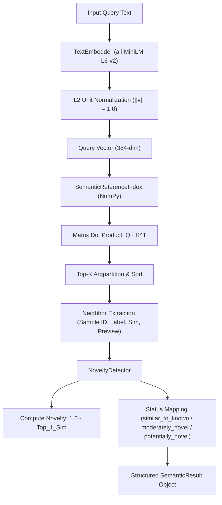
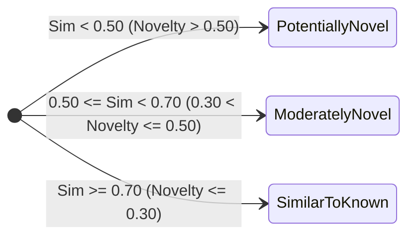

# Phase 7 Specification: Semantic Similarity & Known/Unknown Pattern Detection

## 1. Objective & Conceptual Scope

The **Semantic Similarity and Novelty Detection Layer** provides dense vector semantic retrieval and distribution-divergence detection for ScamShield AI.

### Core Conceptual Separation
$$\text{SEMANTIC NOVELTY} \ne \text{SCAM VERDICT}$$
$$\text{SEMANTIC SIMILARITY} \ne \text{SCAM PROBABILITY}$$

* **Semantic Similarity** answers: *"Which previously seen reference messages share underlying semantic meaning with this query message?"*
* **Novelty Detection** answers: *"Does this message diverge significantly from the known reference distribution, suggesting an emerging or uncataloged pattern?"*

A novel message may be:
- An entirely benign message featuring unusual or specialized vocabulary.
- An unusual conversational exchange or dialectal expression.
- A genuinely new, evolving scam technique (e.g., smart meter electricity fraud, deepfake extortion).

Conversely, a high-similarity message may be:
- A benign message matching common conversational dialogue (e.g., "See you at 7pm").
- A scam message replicating a known campaign template (e.g., bank KYC phishing).

Therefore, **Phase 7 outputs evidentiary semantic information only. It does not compute a final scam score, confidence score, or classification label.**

---

## 2. Architecture & Pipeline



### Component Overview
* [`src/semantic/schemas.py`](file:///c:/Users/radika/OneDrive/Desktop/ScamShieldAI/src/semantic/schemas.py): Strongly-typed dataclasses for `ReferenceItem`, `NeighborResult`, `SemanticAnalysis`, and `SemanticResult`.
* [`src/semantic/embedder.py`](file:///c:/Users/radika/OneDrive/Desktop/ScamShieldAI/src/semantic/embedder.py): Encapsulates local transformer inference, L2 normalization, and `.npy` / `.json` binary disk caching.
* [`src/semantic/similarity.py`](file:///c:/Users/radika/OneDrive/Desktop/ScamShieldAI/src/semantic/similarity.py): Mathematical cosine similarity functions operating on normalized vectors and matrices with numerical clamping to `[-1.0, 1.0]`.
* [`src/semantic/reference_index.py`](file:///c:/Users/radika/OneDrive/Desktop/ScamShieldAI/src/semantic/reference_index.py): In-memory NumPy index holding the 3,881 training reference items and embeddings.
* [`src/semantic/novelty.py`](file:///c:/Users/radika/OneDrive/Desktop/ScamShieldAI/src/semantic/novelty.py): Computes relative `semantic_novelty_score` and categorizes provisional operational semantic status.
* [`src/semantic/analyzer.py`](file:///c:/Users/radika/OneDrive/Desktop/ScamShieldAI/src/semantic/analyzer.py): High-level orchestrator coordinating embedder, reference index, and novelty detector for single and batch queries.
* [`src/semantic/split_loader.py`](file:///c:/Users/radika/OneDrive/Desktop/ScamShieldAI/src/semantic/split_loader.py): Authoritative loader reproducing the exact Phase 3 cluster-safe train/val/test splits.
* [`src/semantic/__main__.py`](file:///c:/Users/radika/OneDrive/Desktop/ScamShieldAI/src/semantic/__main__.py): CLI runner supporting index building and interactive demonstrations.

---

## 3. Embedding Model Specifications

* **Model Name**: `sentence-transformers/all-MiniLM-L6-v2`
* **Base Architecture**: MiniLM-L6-H384-uncased (6 transformer layers, 384 hidden units, 12 attention heads).
* **Embedding Dimension**: **384** float32 values.
* **Normalization**: L2 unit normalization ($\|\vec{v}\|_2 = 1.0$).
* **Offline Execution**: Following initial local caching, model execution runs 100% offline via `local_files_only=True`. No cloud endpoints, remote tokens, or external APIs are required.

---

## 4. Reference Corpus Design

The reference corpus represents the repository of historical benchmark communications against which incoming queries are compared.

### Isolation Rules
* **TRAIN Partition Only**: The reference index is populated strictly from the **3,881 samples** of the Phase 3 training partition (`data/processed/preprocessed/uci_sms_spam.jsonl`).
* **Zero Validation/Test Ingestion**: Validation (837 samples) and test (856 samples) records are **never** inserted into the reference index.
* **Metadata Preserved**: Each reference item retains its canonical `sample_id`, `label` (`scam` or `non_scam`), `text`, `text_preview`, `source_reference`, and `pattern_group_id`.

> **Dataset Provenance & Benchmark Labels**: The reference dataset derives from the UCI SMS Spam Collection (historically labeled `spam`/`ham`). In Phase 3, these were normalized to `scam`/`non_scam` for baseline text classification. As noted throughout ScamShield documentation, historical promotional spam does not equate to verified real-world scam evidence. The reference labels are project benchmark labels and do not establish verified fraudulent provenance.

---

## 5. Mathematical Formulations

### 5.1 Cosine Similarity
For two unit-normalized vectors $\vec{u}$ and $\vec{v}$ ($\|\vec{u}\|_2 = \|\vec{v}\|_2 = 1$):
$$\text{sim}(\vec{u}, \vec{v}) = \vec{u} \cdot \vec{v} = \sum_{i=1}^{384} u_i v_i$$
For a query vector $\vec{q} \in \mathbb{R}^{384}$ and reference matrix $R \in \mathbb{R}^{N \times 384}$:
$$\vec{s} = R \vec{q} \in \mathbb{R}^N$$
Values are clamped to the mathematical interval $[-1.0, 1.0]$.

### 5.2 Top-$K$ Retrieval
The top-$K$ indices are selected via linear-time partial partition:
$$\mathcal{I}_{\text{top-}K} = \text{argpartition}(-\vec{s}, K)[:K]$$
The resulting $K$ candidates are sorted in descending order of similarity:
$$s_{(1)} \ge s_{(2)} \ge \dots \ge s_{(K)}$$

Retrieval is strictly driven by dense vector proximity and is **independent of ground-truth labels**.

### 5.3 Semantic Novelty Score
The relative novelty score is defined as the complement of the nearest reference neighbor similarity:
$$\text{semantic\_novelty\_score} = \text{clip}(1.0 - s_{(1)}, 0.0, 2.0)$$
* When $s_{(1)} = 1.0$ (exact semantic match): $\text{novelty} = 0.0$.
* When $s_{(1)} = 0.70$ (close reference match): $\text{novelty} = 0.30$.
* When $s_{(1)} \le 0.0$ (divergent pattern): $\text{novelty} \ge 1.0$.

> **Statistical Interpretation**: `semantic_novelty_score` is an **uncalibrated relative distance measure** from the nearest reference example. It is **NOT**:
> - a probability
> - a confidence score
> - a scam score
> - an anomaly probability

---

## 6. Provisional Operational Status Framework

Rather than claiming a "calibrated" or "optimal universal" threshold, Phase 7 adopts three **provisional operational status bands** for exploratory reporting:



| Semantic Status | Top-1 Similarity | Novelty Score | Provisional Operational Interpretation |
| :--- | :---: | :---: | :--- |
| **`similar_to_known`** | $\ge 0.70$ | $\le 0.30$ | Close semantic match to an existing reference pattern in the training corpus. |
| **`moderately_novel`** | $0.50 \le \text{sim} < 0.70$ | $0.30 < \text{nov} \le 0.50$ | Intermediate semantic proximity; notable phrasing differences from reference corpus. |
| **`potentially_novel`** | $< 0.50$ | $> 0.50$ | Significant vector divergence from the reference corpus. Triggers exploratory forensic interest. |

> **Calibration Notice**: The threshold $0.70$ is a **provisional operational boundary**, not a mathematically proven optimal threshold. Ground-truth calibration requires a dedicated novelty benchmark containing verified novel scam campaigns, which will be established in future phases.

---

## 7. Pilot Qualitative Annotations vs. Semantic System Output

To prevent conceptual confusion, the system explicitly separates:
* **Human Annotation (`known` / `unknown`)**: Represents whether an annotator recognized a familiar social engineering scenario or assigned it an unclassified pattern status.
* **Semantic System Output (`similar_to_known` / `moderately_novel` / `potentially_novel`)**: Represents dense vector distance to the 2004 training corpus.

An annotator marking a message as "known" human chat while the semantic engine flags it as "potentially novel" (e.g. colloquial Hinglish slang *"Tension ah?what machi?any problem?"*, Top-1 Sim 0.3061) is an expected finding: human familiarity does not guarantee high vector density in a legacy UK SMS dataset.

---

## 8. Strict Data Leakage Prevention

Leakage protection is enforced programmatically:
1. **Disjoint Identifiers**: `ref_ids ∩ val_ids = ∅` and `ref_ids ∩ test_ids = ∅`.
2. **Disjoint Verbatim Texts**: Exact string matches do not cross partition boundaries.
3. **Disjoint Normalized Texts**: Normalized lowercased string duplicates do not cross partition boundaries.
4. **Self-Retrieval Guard**: If a query's `sample_id` matches any item in the reference corpus, `search(...)` raises `ValueError("Data leakage violation...")`.

---

## 9. Output Schema Specification

The `SemanticResult.to_dict()` method outputs standard JSON:
```json
{
  "sample_id": "val_sms_0010",
  "text": "Had your mobile 11 months or more? U R entitled to Update...",
  "semantic": {
    "embedding_model": "sentence-transformers/all-MiniLM-L6-v2",
    "embedding_dimension": 384,
    "top_k": 5,
    "top_1_similarity": 0.9021,
    "top_3_max_similarity": 0.9021,
    "top_5_max_similarity": 0.9021,
    "top_5_mean_similarity": 0.8845,
    "top_5_scam_count": 5,
    "top_5_non_scam_count": 0,
    "nearest_scam_similarity": 0.9021,
    "nearest_non_scam_similarity": null,
    "semantic_novelty_score": 0.0979,
    "semantic_status": "similar_to_known"
  },
  "neighbors": [
    {
      "sample_id": "uci_sms_0320",
      "similarity": 0.9021,
      "label": "scam",
      "source": "src_uci_sms_spam_228#L320",
      "text_preview": "December only! Had your mobile 11mths+? You are entitled to update to the latest colour camera mo..."
    }
  ]
}
```

---

## 10. Known Limitations & Scaling Considerations

1. **Reference Corpus Bias**: The current reference corpus reflects 2004 SMS messaging patterns. Emerging modern scams (e.g., WhatsApp digital arrest, Telegram task fraud, UPI QR frauds) will naturally trigger `potentially_novel` until reference sets are enriched.
2. **In-Memory Scalability**: The NumPy dot-product engine executes in $< 1.5\text{ ms}$ for 3,881 records ($\sim 6\text{ MB}$). For corpus sizes up to $50,000$ records, NumPy remains optimal. If the reference corpus scales beyond $500,000$ samples in future iterations, approximate nearest neighbors (HNSW / FAISS) can be introduced without altering upstream APIs.

---

## 11. Documentation Integrity Repair

This specification document was updated to maintain strict documentation integrity:
* Replaced claims of $0.70$ being a "calibrated threshold" with "provisional operational boundary for exploratory categorization".
* Clarified that `semantic_novelty_score` is an uncalibrated relative distance, not a probability, confidence, or scam score.
* Clarified UCI dataset labels as normalized benchmark labels rather than verified real-world scam evidence.
* Formally distinguished human qualitative pilot annotations (`known`/`unknown`) from dense vector semantic status.
* Reaffirmed architectural invariance: Phases 3–6 remain frozen and untouched.
